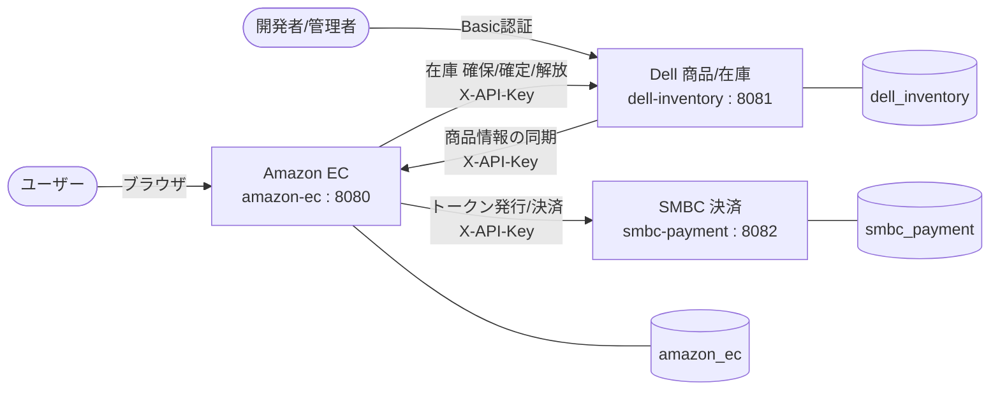
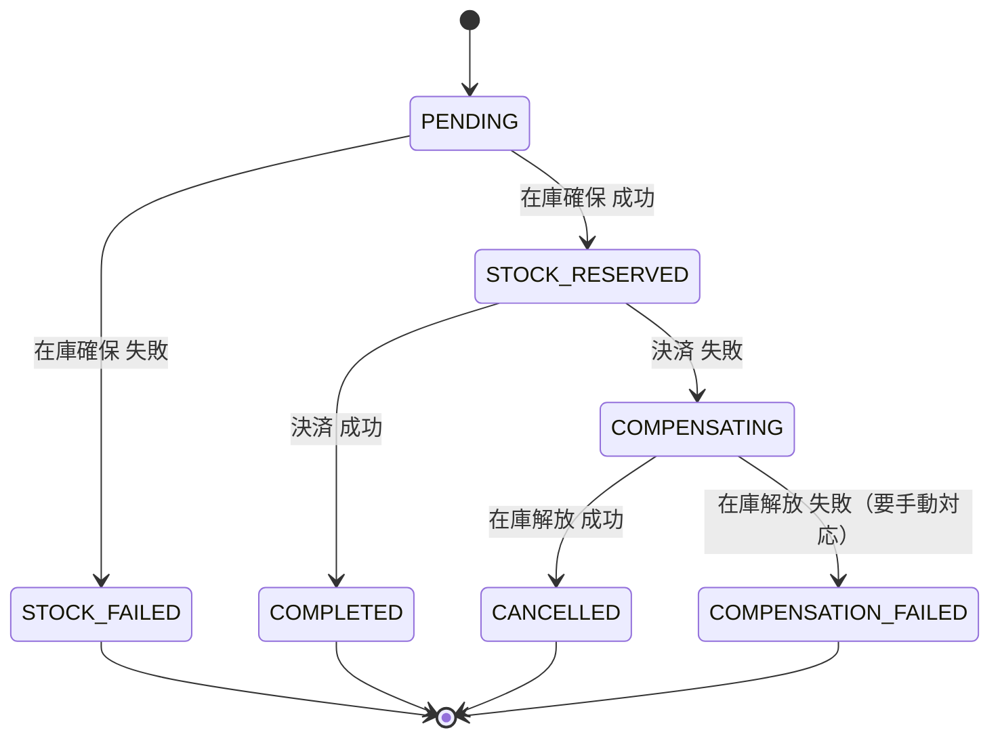

# 分散ECサイト学習プロジェクト（Amazon × Dell × SMBC）

「ECサイト」「商品/在庫を持つ会社」「決済会社」という**3つの独立した会社がAPIで連携して1つの取引を成立させる**構造を、実際に手を動かして学ぶために作った個人開発プロジェクトです。

元々はEC機能も決済機能も1つのDBで完結するモノリシックな作りでしたが、「実際の商取引は複数の独立した会社がAPI越しに連携している」という構造そのものを学ぶ目的で、3つの独立したSpring Bootアプリケーション（3つの独立したDB）に分割しました。

## デモ（本番環境）

| サービス | URL |
|---|---|
| Amazon EC（購入者向け・管理者向け） | https://amazon-ec.onrender.com |
| Dell 商品/在庫管理（管理者向け・要Basic認証） | https://dell-inventory.onrender.com |
| SMBC 決済（API専用、画面なし） | https://smbc-payment.onrender.com |

## このプロジェクトについて

学習の焦点は「登場人物の数」ではなく、**別々の会社（別々のDB）がAPI越しにやり取りして1つの取引を成立させる構造そのもの**です。そのため、各業種を1社ずつに絞ったシンプルな三すくみ構成にしています。

- **Amazon（amazon-ec）**: ユーザーが商品を検索・購入するECサイト本体。ユーザー認証、カート、注文、カード登録、管理者向け注文管理画面を持つ。
- **Dell（dell-inventory）**: 商品を出品し在庫を管理する会社。商品登録・在庫の確保/確定/解放、管理者向け商品管理画面を持つ。
- **SMBC（smbc-payment）**: 決済だけを行う会社。カードトークンの発行と決済のみのAPI専用サービスで、画面は持たない。

## システム構成



3つのDBの間に外部キーはなく、あくまでAPI経由でのみ連携しています。通信は同期HTTP（Spring WebClient）を採用し、決済のように即座に成功/失敗を知りたい処理を素直に扱えるようにしています。

## 使用技術

- **バックエンド**: Java 17 / Spring Boot 3.3.4 / Spring Security / Spring Data JPA
- **DB**: PostgreSQL / Flyway（マイグレーション管理）
- **View**: Thymeleaf
- **インフラ**: Docker / docker-compose（ローカル一括起動） / Render（本番、3サービスを個別のWebサービスとしてデプロイ）
- **CI**: GitHub Actions / Qodana（静的コード品質チェック）
- **テスト**: JUnit 5 / Mockito

3プロジェクトとも同じ層構成（controller / service / entity / repository / dto / exception）で統一しています。

## 主な機能

**ユーザー向け（Amazon EC）**
- 会員登録・ログイン（Spring Security + BCrypt、`@AuthenticationPrincipal`から取得する改ざん不可能なuserIdのみでデータを絞り込み）
- 商品一覧（カテゴリ別アイコンナビゲーション、ページネーション）
- カテゴリ別詳細検索（価格帯・RAM/SSD/CPUメーカー/GPU有無での絞り込み）
- カート（数量変更・削除、在庫を超える数量は追加/変更不可）
- 在庫切れ表示（在庫0の商品は一覧・詳細で「在庫切れ」表示になり、購入不可）
- 注文（Sagaパターンによる在庫確保〜決済〜確定）
- 注文履歴（本人の注文のみ表示、購入完了分は商品画像・商品名・「もう一度買う」ボタンを表示）
- カード登録（生のカード番号はAmazon側に保存せず、SMBCが発行したトークンのみ保持）

**管理者向け**
- Amazon: 注文管理画面（ステータスごとに色分け表示、注文IDでの部分一致検索、ページネーション、金額列）
- Dell: 商品管理画面（新規登録・販売停止/再開、商品ID・商品名での部分一致検索、ページネーション、Basic認証で保護）

**サービス間連携・セキュリティ**
- サーバー間通信は通信方向ごとに独立したAPIキー（`X-API-Key`ヘッダー）で保護（1つの鍵を使い回さない方針）
- Dellで在庫が確保/解放されるたびにAmazon側の在庫キャッシュを同期し、表示上の在庫と実在庫のズレを防止

## 注文のステータス遷移（Sagaパターン）

3社にまたがる取引のため「在庫は確保できたが決済は失敗した」のような中途半端な状態が起こり得ます。これを扱うために補償トランザクション（Sagaパターン）を採用しています。



## 設計判断のポイント

- **在庫の真実の所在**: 在庫の実体は常にDellが持ち、Amazonは表示用のキャッシュのみを保持する。当初はDellが在庫を確保/解放してもAmazonへの同期が発生せず、注文が入るたびに表示上の在庫が実態からズレていく不具合があった。原因をコードから特定し、確保/解放が成功した際にもAmazonへ同期するよう修正した。
- **決済トークン方式**: PCI DSS的な発想で、生のカード番号はAmazon側に一切保存しない。カード登録時にSMBCへ生カード情報を送りトークンを受け取り、以降はトークンのみでやり取りする。
- **消費税計算の一元化**: Dellの価格は税抜きのまま扱い、税込み換算はAmazon側の`TaxCalculator`に一本化。表示（一覧・カート）と実際の請求額（SMBCへの送金額）が常に一致するようにしている。
- **相関ID**: 3社のログを串刺しで追えるよう、`ORD-yyyyMMdd-連番4桁`形式の共通注文IDを採番。
- **楽観ロック**: 同時に同じ商品へ注文が入った場合の在庫の取り合いに対応するため、予約エンティティに`version`フィールドを持たせ楽観ロックで制御。
- **サーバー間認証キーの分離**: Dell↔Amazon、Amazon↔SMBCでそれぞれ別のAPIキーを使う方針。管理の手間は増えるが、「サーバー間認証」自体を扱うことがこの学習のコアテーマだったため採用した。
- **商品画像の自動割当**: DBには画像パスを持たせず、商品IDのハッシュ値からカテゴリごとの画像ファイルを決定的に選ぶ仕組みにした。画像を増やす際もファイルを置くだけでよく、DBやシードスクリプトの変更が不要。

## リポジトリ構成

| プロジェクト | 役割 | リポジトリ |
|---|---|---|
| amazon-ec | ECサイト本体（このリポジトリ） | （このリポジトリ） |
| dell-inventory | 商品会社（在庫・予約管理） | https://github.com/kaisoccer19960414-cmd/dell-inventory |
| smbc-payment | 決済会社（カードトークン・決済） | https://github.com/kaisoccer19960414-cmd/smbc-payment |

## ローカルでの動かし方

3リポジトリを同じ階層に配置し、その親ディレクトリに`docker-compose.yml`と`.env`を用意した上で、以下を実行します。

```bash
docker-compose up --build
```

起動後、`http://localhost:8080`（Amazon）でECサイトにアクセスできます。

## 今後の展望

- 商品を大量に投入した上でのボットによる購入シミュレーション（負荷・同時実行のさらなる検証）
- 在庫切れ商品のカート追加をより厳密にブロックする仕組みの継続的な改善
